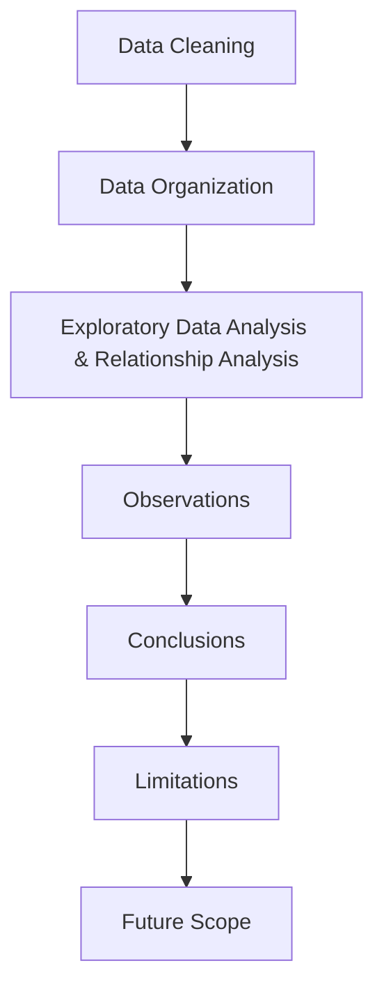

# 📊 Employee Attrition Analysis: Uncovering Drivers of Workforce Turnover

## 📌 Project Overview
Employee turnover is a massive cost for modern enterprises. This project performs an in-depth Exploratory Data Analysis (EDA) on a Human Resources dataset to identify the core variables that drive employees to leave a company. 

Rather than just reporting who left, this analysis dives into *why* they left—investigating the relationships between compensation, work experience, commute, and overtime to extract actionable business insights.

## 💾 The Dataset
* **Name:** IBM HR Analytics Employee Attrition & Performance
* **Source:** [Kaggle - IBM HR Analytics Attrition Dataset](https://www.kaggle.com/datasets/pavansubhasht/ibm-hr-analytics-attrition-dataset)
* **Size:** 1,498 records × 35 features
* *Note: The original IBM dataset contains 1,470 rows. For educational purposes, 28 duplicate rows were intentionally injected into the dataset prior to analysis to demonstrate and practice data cleaning and duplicate removal techniques.*
* **Target Variable:** `Attrition` (Yes/No)

## 🛠️ Tech Stack
* **Language:** Python
* **Data Manipulation:** `pandas`, `numpy`
* **Data Visualization:** `matplotlib`
* **Environment:** Jupyter Notebook

---

## ⚙️ Methodology Pipeline



### 1. Data Cleaning
To ensure accuracy before analysis, the raw data underwent rigorous preprocessing:
* **Missing Value Verification:** Scanned and confirmed no null values existed.
* **Duplicate Row Removal:** Identified and dropped the 28 injected duplicate records.
* **Feature Reduction:** Dropped structurally irrelevant and analytically unreliable columns (e.g., `EmployeeCount`, `StandardHours`, `DailyRate`).
* **Data Type Correction:** Converted ordinal text columns into proper categorical data types to optimize memory and grouping.

### 2. Data Organization
* **Logical Sorting:** The cleaned dataset was sorted in descending order by `MonthlyIncome` and re-indexed to provide a logical, readable structure for baseline statistical analysis.

### 3. Exploratory Data Analysis (EDA) & Relationship Analysis
Visualizations were generated using Matplotlib to uncover hidden patterns and answer seven critical business questions:
1. Does monthly income affect employee attrition?
2. How does overtime affect employee attrition?
3. Are employees with less work experience more likely to quit?
4. Does distance from home affect employee attrition?
5. Does more business travel lead to more employee attrition?
6. Does the department in which the employee works affect their decision to leave the company?
7. At what age do employees tend to quit?

---

## 🔍 Key Observations
* Employees who quit earn a lower average monthly income.
* A majority of the departing employees worked overtime.
* Employees with less than 10 years of experience are the most likely to leave.
* Longer commute distances lead to a higher rate of attrition.
* Frequent business travel increases the attrition rate to roughly 25%.
* The Sales department has the highest turnover (21%), while R&D is the most stable (14%).
* Departing employees are mostly younger, usually in their late twenties to early thirties.
* The age boxplot reveals two senior-level outliers who also left the company.

## 🎯 Final Conclusions
* **Primary Causes of Turnover:** Low salaries, excessive overtime, and high-stress situations (like frequent travel) are the main reasons employees leave the company. 
* **Highest Risk Group:** Younger employees with less than 10 years of experience and long daily commutes are the most likely to quit.
* **Action Plan for Retention:** To keep employees, the company needs to improve pay, strictly control overtime hours, and offer flexible work options or travel help.

## ⚠️ Limitations
* **Imbalanced Dataset:** The dataset is heavily skewed (83% of employees stayed, while only 17% left), which can make it difficult to fully understand the minority group and may bias predictive models.
* **Static Snapshot:** The data represents a single point in time rather than a historical timeline, meaning it cannot capture long-term trends or how employee sentiment changes over months or years.
* **Subjective Metrics:** Features such as Job Satisfaction and Work-Life Balance are based on self-reported survey data, making them vulnerable to personal bias.

## 🚀 Future Scope
* **Predictive Machine Learning:** The logical next step for this analysis is to build a predictive classification model using algorithms like Logistic Regression or a Random Forest Classifier to proactively flag current employees who have a high probability of leaving.
* **Data Balancing:** Implement techniques like SMOTE (Synthetic Minority Over-sampling Technique) to balance the dataset before training machine learning models.

---

## 💻 How to Run This Project
1. Clone this repository to your local machine.
2. Ensure you have Jupyter Notebook installed along with the required libraries. You can install them using:
   ```bash
   pip install jupyter pandas numpy matplotlib seaborn
   ```
3. Open `analysis.ipynb` in your Jupyter environment.
4. Ensure `Employee-Attrition-Dataset.csv` is in the same directory.
5. Run the cells sequentially to view the data cleaning steps and interactive visualizations.